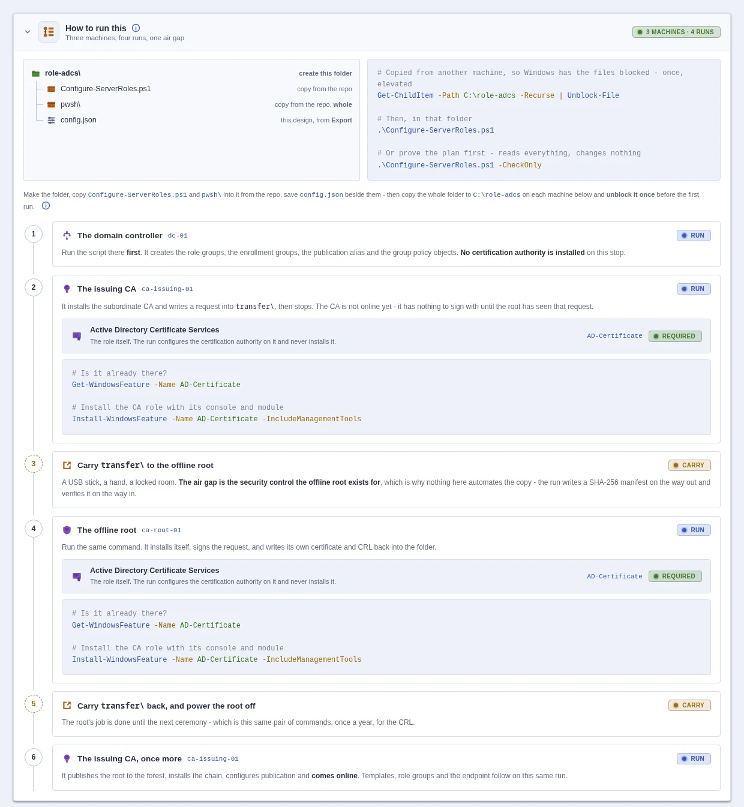

<div align="center">

<picture>
  <source media="(prefers-color-scheme: dark)" srcset=".github/assets/wordmark-dark.png">
  
</picture>

<p><b>Design a Windows Server deployment in the browser. Configure it with PowerShell.</b></p>

<p>


</p>

</div>
<div align="justify">

If you need the machines first, [**HyperV-VM-Studio**](https://github.com/Barg0/HyperV-VM-Studio)
is the same idea one layer down: design the VMs in the browser, build them with PowerShell, and
they come up installed and domain-joined without you touching them. I use the two together — that
one turns an ISO into running servers, this one turns those servers into a domain, a PKI, a file
server, whatever the lab is for. A whole test environment in an afternoon, and you can throw it
away and do it again next week.

</div>

## <picture><source media="(prefers-color-scheme: dark)" srcset=".github/assets/icons/servers-dark.png"></picture> What this is
<div align="justify">

There are two parts to it. One is a single HTML file you open straight from disk — no web server,
nothing to install — where you click together what a Windows server should be. The other is a
PowerShell script that reads what you designed and actually sets it up.

So you pick the roles, fill in what they ask for, and download `config.json`. Then you copy that
file, the script and the `pwsh\` folder onto the server and run it:

</div>

```
html\ServerRoleConfigurator.html  →  config.json  →  Configure-ServerRoles.ps1  →  configured roles
```
<div align="justify">

One config covers a whole deployment rather than one machine. Take the same folder to the domain
controller, the CA and the file server — each run picks out the part that names it and leaves the
rest alone.

The script configures roles, it doesn't install them. If one is missing it stops and prints the
`Install-WindowsFeature` line, so what a server is for stays your decision. Three roles are the
exception and do install themselves, because there's no sensible way around it: Hyper-V (you can't
configure a host before it's a hypervisor), Exchange (`setup.exe` pulls in its own features anyway)
and the SCEP/NDES tier (everything it installs is needed later in the same run).

Every role has its own page in the studio, and each one starts with a **How to run this** card:
the folder to build, which machine to take it to first, and what the run does when it gets there.
Certificate Services, for example, spans three machines and four runs — so that is what its
card lays out:

</div>

<picture>
  <source media="(prefers-color-scheme: dark)" srcset=".github/assets/blades/runbook-dark.webp">
  
</picture>
## <picture><source media="(prefers-color-scheme: dark)" srcset=".github/assets/icons/certificate-dark.png"></picture> What it can configure

| Role | What the run sets up |
|---|---|
| **Active Directory Domain Services** | A new forest or another controller, sites, UPN suffixes, and the settings that only apply after the promotion reboot |
| **DNS Server** | Forwarders, zones, reverse zones, scavenging |
| **Certificate Services** | A two-tier PKI — offline root, issuing CA, templates, role groups, publication, hardening |
| **Intune Certificate Connector** | The SCEP/NDES side of it, either alongside the PKI or bolted onto one you already have |
| **File Server** | Shares with tight ACLs, DFS namespaces, shadow copies and the drive-map policies |
| **Print Server** | Drivers, TCP/IP ports, queues, and the policies that push them out to people |
| **DHCP Server** | Scopes, options, DNS registration — or joining an existing server as its failover partner |
| **Remote Desktop Services** | A quick session deployment or a full farm, with FSLogix, licensing and certificates |
| **Exchange Server SE** | The mailbox role from your ISO, then namespace, certificate, connectors and hardening |
| **Hyper-V** | A single host, or a two-node Storage Spaces Direct cluster |
| **Entra Private Network Connector** | A connector server of its own — installed, registered against the tenant, and publishing on-premises applications without opening anything inbound |
| **Windows Admin Center** · **Azure Arc** | Management agents, which can sit on any of the servers above |
| **Let's Encrypt certificate** | Just a certificate and its renewal, added to something that already runs |

<div align="justify">

Certificates can come from your own CA, from Let's Encrypt over DNS-01, or be self-signed, and one
nightly task renews whatever that server ended up holding.

</div>

## <picture><source media="(prefers-color-scheme: dark)" srcset=".github/assets/icons/security-dark.png"></picture> Before you use it
<div align="justify">

> **This is a lab project. Please don't point it at production.**

I wrote it for my own test environment, and that is where it has been used. A few things worth
knowing before you run it anywhere else:

- It really does change servers — promotes domain controllers, builds certification authorities,
  formats volumes, writes group policy, reboots machines. Only run it on a machine you would be
  happy to rebuild.
- Expect bugs. Parts of it have run dozens of times; other parts have run once, on a bench —
  against a lab I rebuild with HyperV-VM-Studio whenever I break it.
- Only Windows Server 2025 is tested. Older versions might work — I haven't checked.
- `config.json` can contain passwords in clear text, so delete it from the server afterwards.
- No warranty of any kind. What you run on your own servers is your call.

</div>

## <picture><source media="(prefers-color-scheme: dark)" srcset=".github/assets/icons/files-dark.png"></picture> Layout
<pre>
<picture><source media="(prefers-color-scheme: dark)" srcset=".github/assets/icons/files-dark.png"></picture> WindowsServer-RoleStudio
├─ <picture><source media="(prefers-color-scheme: dark)" srcset=".github/assets/icons/overview-dark.png"></picture> html\ServerRoleConfigurator.html   the studio, one self-contained file
├─ <picture><source media="(prefers-color-scheme: dark)" srcset=".github/assets/icons/powershell-dark.png"></picture> Configure-ServerRoles.ps1          the script you run
├─ <picture><source media="(prefers-color-scheme: dark)" srcset=".github/assets/icons/powershell-dark.png"></picture> pwsh\                             one file per role, loaded by the script
├─ <picture><source media="(prefers-color-scheme: dark)" srcset=".github/assets/icons/install-media-dark.png"></picture> isos\                             installation media, never committed
└─ <picture><source media="(prefers-color-scheme: dark)" srcset=".github/assets/icons/settings-dark.png"></picture> logs\                             one log per run, timestamped
</pre>
<div align="justify">

Logs end up in `logs\configure-serverroles\`, tagged `[ info ] [ o.k. ] [ warn ] [ error ]`.

</div>

## <picture><source media="(prefers-color-scheme: dark)" srcset=".github/assets/icons/powershell-dark.png"></picture> Running it
<div align="justify">

Put the script, the `pwsh\` folder and your `config.json` together in one folder and copy that
folder to the server. I name mine after the role and keep them on `C:\`:

</div>

<pre>
<picture><source media="(prefers-color-scheme: dark)" srcset=".github/assets/icons/files-dark.png"></picture> C:\role-adcs
├─ <picture><source media="(prefers-color-scheme: dark)" srcset=".github/assets/icons/powershell-dark.png"></picture> Configure-ServerRoles.ps1
├─ <picture><source media="(prefers-color-scheme: dark)" srcset=".github/assets/icons/powershell-dark.png"></picture> pwsh\
└─ <picture><source media="(prefers-color-scheme: dark)" srcset=".github/assets/icons/settings-dark.png"></picture> config.json
</pre>
<div align="justify">

Windows blocks files that came from another machine, and PowerShell then refuses to load the
`pwsh\` parts. So in an elevated PowerShell:

</div>

```powershell
# Once, after copying the folder over
Get-ChildItem -Path C:\role-adcs -Recurse | Unblock-File

# Then, from inside the folder
.\Configure-ServerRoles.ps1

# Or look at the plan first - this reads everything and changes nothing
.\Configure-ServerRoles.ps1 -CheckOnly
```
<div align="justify">

Which machine to start with, and what happens on each one, is on the **How to run this** card at
the top of that role's page in the studio.

</div>

## <picture><source media="(prefers-color-scheme: dark)" srcset=".github/assets/icons/help-dark.png"></picture> Credits

| Project | What it does here |
|---|---|
| [**Posh-ACME**](https://github.com/rmbolger/Posh-ACME) | Does all of the Let's Encrypt work here — the account, the DNS-01 challenge and the DNS plugins the studio lists are all its. Installed from the PowerShell Gallery the first time a certificate is needed. |
| [**Let's Encrypt**](https://letsencrypt.org) | The CA those certificates come from. |
| **Microsoft** | Windows Server itself, and the installers the run downloads where a role isn't a Windows feature: Windows Admin Center, the Azure Connected Machine agent, the Entra Private Network Connector and FSLogix. Exchange comes from media you supply. The Exchange hardening follows Microsoft's own [Health Checker](https://aka.ms/ExchangeHealthChecker) and [Extended Protection](https://aka.ms/ExchangeEPScript) scripts rather than replacing them. |

<div align="justify">

MIT licensed — see [LICENSE](LICENSE).

</div>
